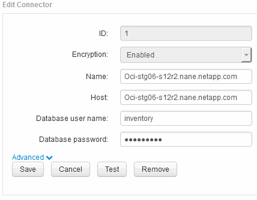

= 使用服务器连接配置UI更改"清单"和"dwh_interne"密码
:allow-uri-read: 
:icons: font
:imagesdir: ../media/

[role="lead"]
如果您需要更改"`inventory`"或`dwh_internal`"密码以匹配Insight服务器上的密码、请使用数据仓库UI。

== 开始之前

要执行此任务、您必须以管理员身份登录。

== 步骤

. 登录到数据仓库门户、网址为 https://hostname/dwh[]、其中hostname是安装了OnCommand Insight 数据仓库的系统的名称。
. 从左侧导航窗格中、单击*连接器*。
+
此时将显示*编辑连接器*屏幕。

+

. 为*数据库密码*字段输入新的"`inventory`"密码。
. 单击 * 保存 * 。
. 要更改`dwh_internal`密码、请单击*高级。*
+
此时将显示编辑连接器高级屏幕。

+
image::../media/dwh-password2.gif[dwh密码2.]

. 在*服务器密码*字段中输入新密码：
. 单击保存。

