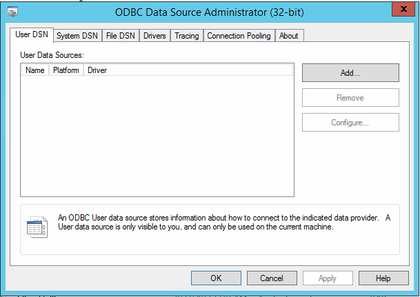
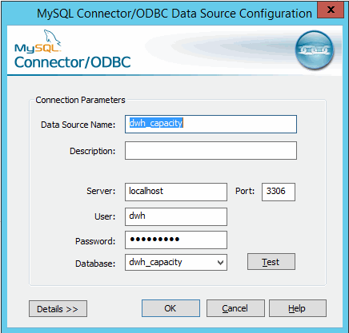

= 使用ODBC管理工具更改dwh密码
:allow-uri-read: 
:icons: font
:imagesdir: ../media/

[role="lead"]
在Insight服务器上更改dwh用户的密码时、还必须在数据仓库服务器上更改此密码。您可以使用ODBC数据源管理员工具更改数据仓库上的密码。

== 开始之前

您必须使用具有管理员权限的帐户远程登录到数据仓库服务器。

== 步骤

. 远程登录到托管该数据仓库的服务器。
. 访问ODBC管理工具、网址为 `C:\Windows\SysWOW64\odbcad32.exe`
+
系统将显示"ODBC数据源管理员"屏幕。

+

. 单击*系统DSN*
+
此时将显示系统数据源。

+
image::../media/system-dsn.gif[系统DSN]

. 从列表中选择一个OnCommand Insight 数据源。
. 单击*配置*
+
此时将显示Data Source Configuration屏幕。

+

. 在*密码*字段中输入新密码。

