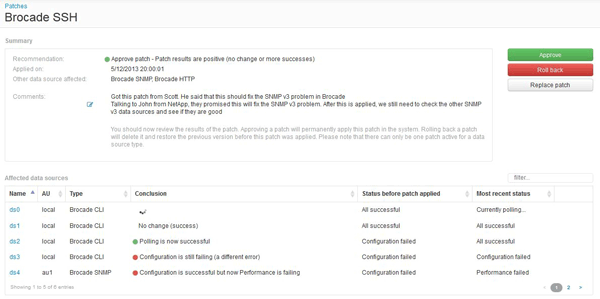

= 提交数据源修补程序
:allow-uri-read: 
:icons: font
:imagesdir: ../media/

[role="lead"]
您可以使用修补程序摘要中的信息来确定修补程序是否按预期运行、然后将修补程序提交到您的网络。

== 开始之前

您已安装修补程序、需要确定修补程序是否成功且应获得批准。

== 步骤

. 在Insight工具栏上、单击*管理*。
. 单击*修补程序*。
+
如果未安装任何修补程序、则当前正在审核的修补程序为空。

. 在*当前正在审核的修补程序*中、检查当前正在应用的数据源修补程序的状态。
. 要检查与特定修补程序关联的详细信息、请单击此修补程序的链接名称。
. 在本示例所示的修补程序摘要信息中、检查*建议*和*注释*以评估修补程序的进度。
+

. 检查*受影响的数据源*表、查看修补程序前后每个受影响数据源的状态。
+
如果您担心要修补的某个数据源出现问题、请单击"受影响的数据源"表中的链接名称。

. 如果您认为应将修补程序应用于此类数据源、请单击*批准*。
+
数据源将发生更改、修补程序将从当前正在审核的修补程序中删除。

