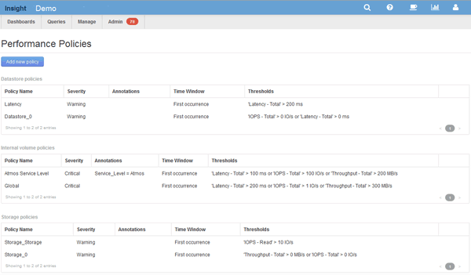

= 创建性能策略
:allow-uri-read: 
:icons: font
:imagesdir: ../media/

[role="lead"]
您可以创建性能策略来设置阈值，这些阈值会触发警报，以向您通知与网络中资源相关的问题。例如，您可以创建一个性能策略，以便在存储池的总利用率超过 60% 时向您发出警报。

== 步骤

. 在浏览器中打开OnCommand Insight。
. 选择*管理*>*性能策略*。
+
此时将显示性能策略页面。

+
策略按对象进行组织、并按其在该对象的列表中显示的顺序进行评估。

. 单击*添加新策略*。
+
此时将显示添加策略对话框。

. 在*策略名称*字段中、输入策略的名称。
+
您必须使用与对象的所有其他策略名称不同的名称。例如、内部卷不能具有两个名为"`Latency`"的策略；但是、您可以为内部卷使用"`Latency`"策略、而为其他卷使用另一个"`Latency`"策略。最佳做法是，无论对象类型如何，始终为任何策略使用唯一名称。

. 从*应用于类型*的对象列表中、选择策略所应用的对象类型。
. 从*带标注*列表中、选择一个标注类型(如果适用)、然后在*值*框中为标注输入值、以便仅将策略应用于设置了此特定标注的对象。
. 如果选择*端口*作为对象类型、请从*连接到*列表中选择端口连接到的对象。
. 从*应用窗口后*列表中、选择何时发出警报以指示阈值违规。
+
首次出现选项会在第一个数据样本超过阈值时触发警报。所有其他选项都会在超过阈值一次且至少在指定时间内持续超过阈值时触发警报。

. 从 * 严重性 * 列表中，选择违规的严重性。
. 默认情况下、有关策略违规的电子邮件警报将发送给全局电子邮件列表中的收件人。您可以覆盖这些设置，以便将特定策略的警报发送给特定收件人。
+
** 单击链接打开收件人列表、然后单击*+*按钮添加收件人。该策略的违规警报将发送到列表中的所有收件人。

. 单击*如果以下任一情况属实、则创建警报*部分中的*任何*链接、以控制警报的触发方式：
+
** *任意*
+
这是默认设置、当超过与策略相关的任何阈值时、系统会创建警报。

** *全部*
+
此设置会在超出策略的所有阈值时创建警报。如果选择*全部*、则为性能策略创建的第一个阈值称为主规则。您必须确保主规则阈值是您最关心的性能策略违规。

. 在 * 创建警报 if* 部分中，选择性能计数器和运算符，然后输入一个值以创建阈值。
. 单击*添加阈值*以添加更多阈值。
. 要删除阈值、请单击垃圾桶图标。
. 如果希望策略在发生警报时停止处理、请选中*如果生成警报、则停止处理其他策略*复选框。
+
例如、如果数据存储库有四个策略、而第二个策略配置为在发生警报时停止处理、则在第二个策略违规处于活动状态时、不会处理第三个和第四个策略。

. 单击 * 保存 * 。
+
此时将显示"性能策略"页面、并且性能策略将显示在对象类型的策略列表中。

