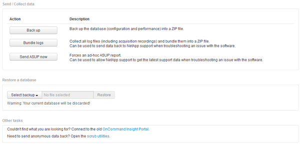

= 还原Insight数据库
:allow-uri-read: 
:icons: font
:imagesdir: ../media/

[role="lead"]
要从经验证的备份文件还原Insight数据库、请使用Troubleshooting选项。此操作将完全替换当前的OnCommand Insight 数据。

== 开始之前

最佳实践：*在还原OnCommand Insight 数据库之前、请使用手动备份过程创建当前数据库的副本。检查计划还原的备份文件、确保该备份成功、其中包含要还原的文件。

== 步骤

. 在Insight工具栏上、单击*管理*。
. 单击*故障排除*。
+

. 在还原数据库部分中、从*选择备份*菜单中选择要还原的备份文件。
. 单击 * 还原 * 。
. 出现所有数据都将被替换的警告时、单击*确定*
+
还原活动的状态将显示在还原页面上。

