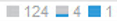

= 使用Anomalies部分
:allow-uri-read: 
:icons: font
:imagesdir: ../media/

[role="lead"]
"异常"部分仅显示在应用程序资产页面上、用于深入了解应用程序基础架构、并可用于确定可能导致服务中断的异常行为。

== 步骤

. 为所需应用程序启用异常监控并允许其收集数据。
. 在异常检测引擎运行期间、您可以在应用程序资产页面的*异常*部分中查看以下信息：
+
** 异常检测分数由一个蓝条显示、表示0到100之间的分数。评分是按资源和计数器进行的、可得出整个应用程序基础架构的总体重要性得分。
** 应用程序资产视图
+
位于异常检测分数下方、显示了所有资产对当前异常分数的影响。如果某个资产对异常分数的影响不大、则以表示 image:../media/anomaly-score-none.gif[""]。如果资产对异常分数的重要性有影响、则会显示1、2或3个蓝条、例如 image:../media/anomaly-score-contributor.gif[""]。由条数表示的值表示该资产对异常分数的贡献的重要性、如下所示：1条= 1-33；2条= 34-67；3条= 68-100。

+
分配给应用程序的资产(主机、虚拟机、卷、内部卷和虚拟机管理程序)以及基础架构中以某种方式连接到已分配资产的资产(例如节点、端口等)会影响异常检测分数。系统会同时显示促成特定异常的资产和不促成特定异常的资产、因为分配的应用程序资源中的数据可能会流经这些资产。

+
如果一种类型的资产超过60个、则会显示*更多*按钮、您可以单击该按钮以显示其余资产。这些剩余资产的状态、例如 、显示在*更多*按钮旁边。此示例显示、在总共129个未显示的资产中、有124个资产不会影响异常分数；但是、其中5个资产确实会对异常分数产生一定程度的影响。

** 异常图
+
异常图显示时间范围(3小时、24小时、3天、7天、30天、 或自定义时间范围)。您可以将指针拖动到图表上方、查看此时间范围内其他点的异常分数、以蓝色圆圈表示、然后单击蓝色圆圈。 此选项将更新应用程序资产视图、以显示在该时间点对分数有贡献的资产。

. 为了帮助您排除资产性能故障、您可以通过执行以下操作将应用程序资产视图中的资产添加到应用程序资产页面中的专家视图图表：
+
.. 单击应用程序资产视图中的资产图标。
+
此时将显示以下内容：资产的名称、此名称是指向资产页面的超链接、导致异常的指标、资产贡献的意义以及用于将资产添加到专家视图图表的按钮。

.. 单击 image:../media/add-to-expert-view-graph.gif[""]。

+
此时、此资产将添加到专家视图图表中。

