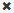

= 使用Violations部分
:allow-uri-read: 
:icons: font
:imagesdir: ../media/

[role="lead"]
通过 Violations 部分，您可以查看和管理因分配给资产的性能策略而在网络中发生的任何违规。

== 步骤

. 登录到OnCommand Insight Web UI。
. 通过执行以下任一操作找到资产页面：
+
** 在Insight工具栏上、单击 image:../media/icon-sanscreen-magnifying-glass-gif.gif[""]、键入资产的名称、然后从列表中选择资产。
** 单击*信息板*、选择*资产信息板*、找到资产名称并单击它。此时将显示资产页面。Violations部分显示违规发生的时间和超过阈值的问题描述 、以及指向发生违规的资产的超链接(例如"`2 violations fir ds-30 with Latency - total > 50`")。

. 您可以执行以下任一可选任务：
+
** 使用*筛选器*框仅显示特定违规。
** 如果表中存在五个以上的违规、请单击页码以按页浏览违规。
** 单击列标题中的箭头，将表中列的排序顺序更改为升序（向上箭头）或降序（向下箭头）。
** 单击任何问题描述中的资产名称以显示其资产页面；红色圆圈表示需要进一步调查的问题。
+
您可以单击性能策略以显示编辑策略对话框，以查看性能策略并在必要时对策略进行更改。

** 单击  如果您确定问题描述 不再是值得关注的发生原因 、则从列表中删除违规。

