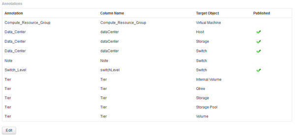

= 将用户定义的标注导入到数据仓库中
:allow-uri-read: 
:icons: font
:imagesdir: ../media/

[role="lead"]
在OnCommand Insight 中强制更新标注后、您需要在数据仓库中选择所需的标注并启动数据仓库构建。您可以等到下一个计划的构建完成、也可以立即启动构建。

== 步骤

. 以管理员身份登录到数据仓库门户、网址为 `+https://hostname/dwh+`、其中 `hostname` 是安装了OnCommand Insight 数据仓库的系统的名称。
. 从左侧导航窗格中、单击*标注*。
+

+
此列表将为每个标注类型显示一行、并显示可将标注分配到的目标对象。"已发布"列中的复选标记表示已为特定目标对象选择此标注、并且此标注已通过数据仓库数据集市可用。

. 单击*编辑*以编辑如何从OnCommand Insight 导入标注。
+
image::../media/oci-dwh-admin-annotations-edit-gif.gif[DWH标注编辑]

. 要编辑标注过程、请执行以下操作：
+
** 选择*已发布*将从OnCommand Insight 检索到的标注添加到数据仓库数据库中。单击*全部*以选择所有对象上的所有标注。单击*无*以确保未选择所有选项。
+
[NOTE]
====
取消选中此选项可从特定对象的清单表和关联数据集市中删除标注列。如果任何自定义设计的报告使用标注数据、则报告将无法成功运行。

====
** 选中*当前初始化*以使用当前标注值初始化数据仓库维度表中的历史数据。单击*全部*以选择所有对象上的所有标注。单击*无*以确保未选择所有选项。发布标注后、此复选框将被禁用；对于未发布的标注、此复选框将处于启用状态。例如、如果为主机添加了标注类型"`Floor`"的标注、并获得值"`1`"、并且host_dimension表中该主机有3行、则选择*含电流*将在host_dimension表的所有3行的"`Floor`"列中关联值"`1`"。如果未选择*当前初始化*、则只有该主机的最新行的楼层列才会显示值"`1`"。

. 单击 * 保存 * 。
+
此时将显示一条警告消息、指出发生原因 如果删除标注、此操作将更改数据或数据丢失的结构。

. 要继续、请单击*是*。
+
数据仓库会启动异步标注作业、以应用请求的更改。您可以在作业页面中查看作业。您还可以查看数据仓库数据库架构中的更改。

