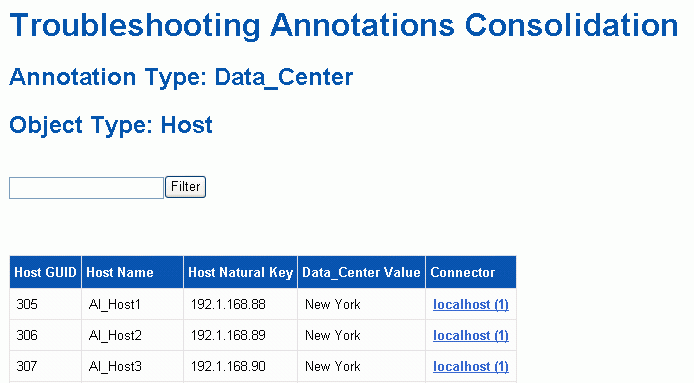

= 解决多个服务器标注整合问题
:allow-uri-read: 
:icons: font
:imagesdir: ../media/

[role="lead"]
数据仓库故障排除视图中的"标注整合"视图显示一个表、其中包含所有可用的标注类型以及可应用这些标注类型的对象类型。

== 关于此任务

标注值的整合取决于标注类型的值。一个存储阵列可以有两个不同的层值、每个层值都来自一个不同的连接器。因此、如果在一个连接器中有一个由名称gold定义的层、而在另一个连接器中、一个层使用名称goldy定义、则此信息将在数据仓库中显示为两个单独的层。

由于某些标注类型允许向同一对象分配多个标注值、因此数据仓库允许对象(例如"`host`")分配多个标注值(例如、可以将"`data center 1`"和"`data center 2"分配给同一主机)。

卷上的层标注的功能与常规标注表略有不同。环境中可能存在大量卷、并且在数据仓库中显示所有卷可能会影响信息的可用性。因此、"Annotations Consolidation"视图仅显示已分配多个层值的卷以及包含每个此类卷的存储。

== 步骤

. 登录到数据仓库门户、网址为 `+https://hostname/dwh+`、其中 `hostname` 是安装了OnCommand Insight 数据仓库的系统的名称。
. 从左侧导航窗格中、单击*故障排除*。
. 在*标注整合*部分中、单击对象所在行中的*显示*。
+
下面显示了Data_Center的标注示例：

+

