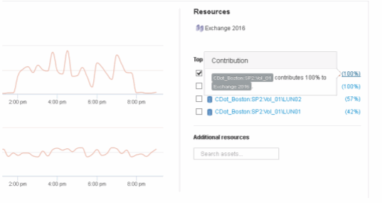

= 分析应用程序性能问题
:allow-uri-read: 
:icons: font
:imagesdir: ../media/

[role="lead"]
本文档介绍了处理有关应用程序影响用户或管理员的性能问题报告时可能采取的步骤。例如、用户抱怨其Exchange应用程序在一整天都处于缓慢状态。

== 关于此任务

在OnCommand Insight 中、应用程序是一个已配置的实体。您可以为应用程序分配名称和业务实体、并为应用程序分配计算和存储资源。这样可以更好地查看基础架构运行状况的端到端视图、并更主动地管理基础架构资产。

== 步骤

. 要开始调查问题描述 、请使用Insight工具栏对Exchange应用程序执行全局搜索。
+
image::../media/search-exchange.gif[搜索Exchange]

+
[TIP]
====
执行搜索时、您可以在对象名称之前添加对象描述符、以细化搜索结果。

====
. 从搜索结果中选择"Exchange 2015"后、系统将显示应用程序登录页面。
+
image::../media/exch2016-land-page.png[2016年外页]

+
在应用程序登录页面中、您需要了解以下信息：

+
** 在选定的24小时时间段内、延迟增加显示在延迟图的右侧。
** 在延迟增加期间、IOPS级别没有显著变化。延迟增加似乎不是由于应用程序使用率较高所致。我们并没有看到存储的IOPS需求较高、这可能会导致延迟峰值。延迟增加可能是由于外部因素造成的。
** 在"Top contributors"部分的图表右侧、单击选定内部卷(CDot_Boston：SP2：Vol_01)的100%。系统显示此资源正在为Exchange 2016应用程序提供100%的支持。 
** 单击此内部卷的导航链接(CDot_Boston：SP2：vol_01)以访问内部卷登录页面。对内部卷的分析可能会提供与延迟峰值相关的信息。

