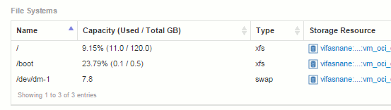

= 配置Insight以收集文件系统
:allow-uri-read: 
:icons: font
:imagesdir: ../media/

[role="lead"]
要配置Insight以收集文件系统利用率数据、您必须安装Host Utilization Pack许可证并配置NetApp主机和VM文件系统数据源。

== 开始之前

如果尚未安装、请安装Host Utilization Pack许可证。您可以在*许可证*选项卡上的*管理*>*设置*页面中检查许可证。

主机和VM文件系统数据源仅报告Insight中当前正在收集或发现的已知*计算资源*(主机和VM)的文件系统利用率和文件系统元数据：

* 虚拟机由Hyper-V和VMware等虚拟机管理程序数据源收集。
* 主机通过设备解析来发现。

相应的存储资源上必须存在正确的层标注。

支持以下已连接的块存储设备：

* NetApp集群模式Data ONTAP (cDOT)
* NetApp 7-模式
* CLARiiON
* Windows：适用于FC、iSCSI的VMware虚拟磁盘(VMDK)
* Linux：VMware VMDK (不支持iSCSI和FC)

*计算资源组*是一个标注、用于对共享通用管理凭据的主机和/或虚拟机进行分组。

== 步骤

. 首先、为要包含在*计算资源组*中的主机和/或虚拟机添加标注。转到*查询*>*+新查询*并搜索_Virtual Machine_资产。
+
您需要对_Host_资产重复这些步骤。

. 单击该表右侧的列选择器、然后选择*计算资源组*列以在查询结果表中显示该列。
. 选择要添加到所需计算资源组的虚拟机。您可以使用筛选器搜索特定资产。
. 单击*操作*按钮、然后选择*编辑标注*。
. 选择_Compute Resource Group_标注、然后在_value_字段中选择所需的资源组名称。
+
资源组标注将添加到选定虚拟机。资源组名称必须与稍后在主机和VM文件系统数据源中配置的名称匹配。

. 要为计算资源组配置主机和VM文件系统数据源、请单击*管理*>*数据源*和*添加*_NetApp主机和VM文件系统_数据源。
+
image::../media/hostutil-dsconfig.gif[hostutil dsconfig]

. 在*配置*部分中、为具有检索文件系统数据的适当权限的操作系统用户输入*用户名*和*密码*。对于Windows操作系统用户、如果您的Windows环境使用域前缀、则此前缀必须包括域前缀。
+
请注意、安装在Linux上的Insight采集单元(AU)可以报告Linux计算资源、而安装在Windows上的AU可以与Linux或Windows计算资源进行通信。

. 输入要从中收集文件系统利用率数据的资产的*计算资源组*名称。此名称必须与用于标注上述资产的资源组名称匹配。
+
如果将计算资源组字段留空、则数据源将收集没有计算资源组标注的主机或虚拟机的数据。

. 在"*高级配置"*部分中、输入此数据源所需的轮询间隔。默认值为6小时通常已足够。
. 建议在保存数据源连接之前对其进行*测试*。成功的连接结果还会显示组中包含多少计算资源目标。
. 单击 * 保存 * 。主机和VM文件系统数据源将在下次轮询时开始收集数据。
. 收集文件系统数据后、您可以在主机或虚拟机的资产页面上的文件系统小工具中查看此数据：
+

. 对您要拥有的每个计算资源组重复上述步骤。每个计算资源组都必须与其自己的主机和VM文件系统数据源相关联。
+
请注意、系统将收集环境中任何传统VMware或Hyper-V数据源已获取的主机和虚拟机的文件系统信息。

