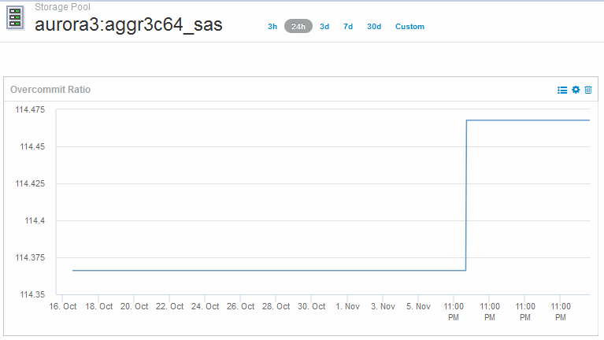

= 创建信息板以监控精简配置环境
:allow-uri-read: 
:icons: font
:imagesdir: ../media/

[role="lead"]
OnCommand Insight灵活的信息板小工具设计和显示图表选项可用于深入分析容量使用情况和利用率、并提供战略信息、以最大程度地降低精简配置数据中心基础架构的风险。

您可以创建信息板来访问要监控的数据存储库和存储池信息。

== 使用信息板访问数据存储库信息

您可能需要创建信息板，以便快速访问要在虚拟基础架构中监控的数据。信息板可能包含类似于以下内容的小工具，用于根据过量使用的 % 确定排名前 10 位的数据存储库，并可包含一个小工具，用于显示数据存储库的容量数据。信息板使用变量突出显示过量使用超过 150% 的数据存储库和超过 80% 已用容量的数据存储库。

image::../media/new-dashboard-thin.gif[新信息板精简]

image::../media/new-dashboard-thin-2.gif[新的信息板精简2.]

可用于监控精简配置环境的其他小工具可能包括以下部分信息：

* 与数据存储库相关的VMDK容量
* VM容量
* 数据存储已用容量趋势

== 使用信息板访问存储池信息

信息板可能包含类似于以下内容的小工具、用于确定已用物理存储容量或确定存储池过量使用的容量。

