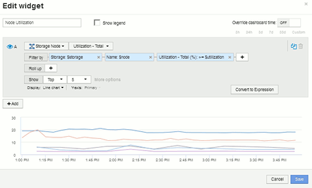
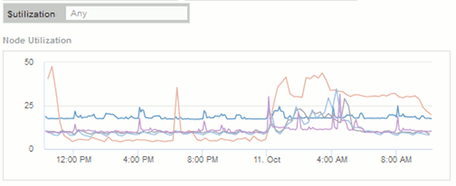

= 包含变量的存储节点利用率信息板示例
:allow-uri-read: 
:icons: font
:imagesdir: ../media/

[role="lead"]
为存储分析创建一个自定义信息板，其中包含存储，存储池，节点，层，利用率和延迟的变量。

== 开始之前

建议您熟悉Insight中的信息板、但这并不是必需的。

== 关于此任务

以下操作步骤将创建一个自定义存储分析概述信息板，其中使用存储，存储池，节点，层，利用率和延迟等变量。以下示例中的变量将用于筛选信息板上一个或多个小工具中显示的资产或指标。使用这些变量作为筛选器的小工具将根据在信息板的变量字段中输入的值根据需要更新经过筛选的内容，从而可以快速筛选多个图表和图形以深入查看特定感兴趣区域。

按照本示例中的步骤，您将创建如下所示的信息板。您可以更改这些小工具或添加任意数量的其他小工具以突出显示所选的任何数据。

image::../media/node-dashboard-example-2.gif[节点信息板示例2.]

== 步骤

. 创建一个新的信息板、并将其命名为"`分析：存储概述`"或其他类似的描述性信息。
. 单击*变量*下拉列表并选择*文本*变量类型。默认情况下、此变量名为_$var1_。单击_$var1_以编辑此名称、并将其更改为$storage_、然后单击复选标记以保存此变量。重复此步骤为_$nodge_、_$pool_和_$volume"创建文本变量。
. 重复上述过程以创建名为_$utilization_and _$latency的*数字*类型变量。
. 单击*变量*下拉列表并搜索_Tier_标注。选择此选项可创建名为_$tier_的变量。
+
您可以随时添加变量，但可以更轻松地预先创建这些变量，因此在创建这些变量时，所有小工具都可以使用这些变量。

. 单击*小工具*下拉列表并选择"*折线图*"或"*分区图*"小工具、添加小工具。将小工具命名为"`Node Utilization`"。单击*存储*资产类型并将其更改为*存储节点*。为图表数据选择*利用率-总计*。
. 单击*按+*筛选器按钮以添加筛选器。搜索并选择*存储*、然后单击*任何*并选择_$storage_变量。
. 单击"++"*按钮为*名称*添加另一个筛选器。将变量设置为_$node_。
+
可以为标注名称筛选器分配不同的变量。根据小工具中的对象，在最低级别使用名称 / 变量对。例如：

+
** 您可以为节点专用小工具的*名称*筛选器分配_$node_变量。
** 您可以将_$pool_变量分配给以池为中心的小工具的*名称*筛选器。

. 单击"++"*按钮为*利用率-总计(%)*添加另一个筛选器。将变量设置为：_>=$utilization_。
. 单击"*汇总"*字段后的* X以折叠此字段。
. 选择*显示前5个*并单击*保存*以保存小工具并返回到信息板。
+
小工具应如下所示：

+

. 向信息板添加另一个折线图或分区图小工具。选择*存储节点*作为资产类型、选择*延迟-总计*作为要绘制图表的指标。
. 单击*按+*筛选器按钮为*存储：$storage*和*名称：$node*添加筛选器。
. 为*延迟-总计*添加一个筛选器、然后选择*。$latenc*变量。
. 将小工具命名为"`Node Latency`"并保存。
. 您可以添加支持表以显示所创建图表的更多详细信息，例如 " 最大节点利用率 " 或 " 平均节点利用率 " 。向信息板添加*表小工具*并选择*存储节点*作为资产类型、然后为*存储：$storage*、*名称：$node*和*利用率-总计：$utilization *创建筛选器。
. 向表中添加*利用率-最大*、*利用率-总计*的列或任何其他所需列。
. 将小工具命名为"`Node Peak and Avg Utilization`"并保存。
+
image::../media/nodeutiltablesettings.gif[nodeutiltablesettings]

. 重复上述步骤为节点延迟创建一个表、根据需要显示*延迟-最大值*、*延迟-总计*或其他列。
. 要对信息板进行全面说明，您可以为以下部分或全部添加其他图表和表小工具：

|===

| 图表 | 表 

 a| 
存储池利用率
 a| 
存储池利用率峰值和平均值

 a| 
存储池吞吐量
 a| 
存储池峰值和平均吞吐量

 a| 
卷延迟
 a| 
卷峰值和平均延迟

 a| 
卷 IOPS
 a| 
卷峰值和平均IOPS

|===
. 您可以根据需要在信息板上的任何位置移动小工具并调整其大小。完成后、请务必*保存*信息板。
+
最后一个信息板将如下所示：

+
image::../media/node-dashboard-example-2.gif[节点信息板示例2.]

. 您可以使用变量关注信息板中的特定资产。在变量字段中输入值时，小工具会自动更新以反映这些变量。例如、通过在$utilization变量字段中输入"`15`"、使用该变量更新的小工具将仅显示总利用率>= 15%的资产。
+
显示所有节点中排名前 5 位的节点利用率小工具：

+

+
节点利用率小工具，显示利用率为 15% 或更高的节点：

+
image::../media/nodeutil-filtered.gif[nodeutil已筛选]

. 创建小工具时，请记住以下几点：
+
** $ti层 变量仅会影响使用*层*标注标注标注的资源。
** 并非所有筛选器都会影响所有小工具，具体取决于小工具是否设计为接受指定的变量。
** 数字变量应用为"`大于或等于指定值`"。请注意，只要任何变量对运行此小工具的资产有效，就可以将其用作存储层次结构中任何级别的任何小工具的筛选器。当您从节点级别向下移动到存储池再移动到卷小工具时，有更多变量可作为筛选器进行分配。例如、在存储节点级别的小工具中、可以将_Storage_和_Name_变量分配为筛选器。在存储池级别、_Storage_、_Nodes_、_Storage Pools_和_Name_均可用。根据需要分配变量，并在堆栈中的最低级别使用 $name 变量。这样， $name 变量就可以筛选正在运行小工具的资产的实际名称。

