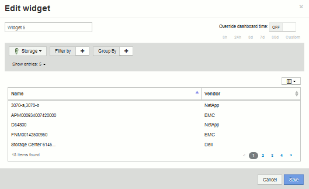

= 自定义信息板：虚拟机性能
:allow-uri-read: 
:icons: font
:imagesdir: ../media/

[role="lead"]
OnCommand Insight的自定义信息板和小工具有助于提供有关清单和性能趋势的操作视图。

== 关于此任务

如今， IT 运营面临着许多挑战。管理员需要以更少的资源完成更多任务，必须全面了解动态数据中心。在此示例中、我们将向您展示如何使用小工具创建自定义信息板、以便您深入了解环境中虚拟机的性能。通过遵循此示例并创建小工具以满足您自己的特定需求、您可以直观地查看后端存储性能与前端虚拟机(VM)性能的对比情况、或者查看虚拟机延迟与I/O需求。

您可以通过自定义信息板确定工作的优先级并确定资源可用性。您可以对工作负载的起伏变化做出响应、并最大限度地缩短检测和修复新出现问题的时间。通过自定义信息板、您可以灵活地创建业务关键型基础架构的优先级视图、并可用于确定多供应商技术的性能可用性。

在此，我们将创建一个虚拟机性能信息板，其中包含以下内容：

* 列出虚拟机名称和性能数据的表
* 虚拟机延迟与存储延迟的比较图表
* 一个图表，显示虚拟机的读取，写入和总 IOPS
* 显示虚拟机最大吞吐量的图表

这只是一个基本示例。您可以自定义信息板、以突出显示和比较您选择的任何性能数据、以确定您自己的最佳运营实践目标。

== 步骤

. 以具有管理权限的用户身份登录到 Insight 。
. 从*信息板*菜单中、选择*+新建信息板*。
+
此时将打开"新建信息板"页面。

. 让我们为信息板提供一个有意义的名称。单击 * 保存 * 。在*名称*字段中、输入信息板的唯一名称、例如"`VM Performance by Application`"。
. 单击 * 保存 * 以使用新名称保存信息板。
. 我们开始添加小工具。如有必要、将*编辑*开关滑到"`on`"以启用编辑模式。
. 单击*小工具*按钮并选择*表小工具*、向信息板添加新的表小工具。
+
此时将打开编辑小工具对话框。默认名称为"`Widget 1`"、显示的默认数据适用于您环境中的所有存储。

+

. 我们可以自定义此小工具。在Name字段中、删除"`Widget 1`"并输入"`Virtual Machine Performance table`"。
. 单击资产类型下拉列表并将*存储*更改为*虚拟机*。
+
此时，表数据将发生变化，以显示您环境中的所有虚拟机。目前、此表仅显示虚拟机名称。让我们向表中添加几列。

. 单击*列*image:../media/column-picker-button.gif[""] 按钮、然后选择_Data Center_、_Storage name_和_IOPS - Total_。您也可以尝试在搜索中键入名称、以快速显示所需字段。
+
此时，这些列将显示在表中。您可以按其中任何一列对表进行排序。请注意，这些列将按添加到小工具的顺序显示。

. 在本练习中，我们将排除当前未使用的虚拟机，因此，我们将筛选出总 IOPS 小于 10 的任何虚拟机。单击*筛选依据*旁边的`+`按钮、然后选择_IOPS -总计(IO/s)_。单击*任何*并在*自*字段中输入"`10`"。将 * 至 * 字段留空。单击 image:../media/check-box-ok.gif[""] 用于保存筛选器的按钮。
+
现在，此表仅显示总 IOPS 为 10 或以上的虚拟机。

. 我们可以通过对结果进行分组来进一步折叠此表。单击*分组依据*旁边的"`+`"按钮、然后选择要分组的字段、例如应用程序或集群。系统将自动应用分组。
+
此时，表行将根据您的设置进行分组。您可以根据需要展开和折叠这些组。分组行显示每个列的汇总数据。某些列允许您为该列选择汇总方法。

+
image::../media/custom-dashboard-editwidget-table-populated-5-5.png[自定义信息板editwidget表填充了5 5.]

. 自定义表小工具以使您满意后、单击*保存*按钮。
+
此时，表小工具将保存到信息板中。

. 您可以通过拖动右下角来调整信息板上的小工具大小。使小工具更宽，以清晰地显示所有列。单击 * 保存 * 以保存当前信息板。
. 接下来，我们将添加一些图表以显示虚拟机性能。我们来创建一个折线图、将虚拟机延迟与存储延迟进行比较。
. 如有必要、将*编辑*开关滑到"`on`"以启用编辑模式。
. 单击*小工具*按钮并选择*折线图*向信息板添加新的折线图小工具。
+
此时将打开编辑小工具对话框。单击*名称*字段并将此小工具命名为"`VM vs Storage Max Latency`"

. 选择*虚拟机*、然后选择*延迟-最大*。设置所需的任何筛选器，或者将 * 筛选器方式 * 留空。对于*汇总*、选择"`Sum`" by "`all`"。将此数据显示为"*折线图"、并保留"Y-Axis"为"*主"。
. 单击*+添加*按钮以添加另一个数据线。对于此行、请选择*存储*和*延迟-最大*。设置所需的任何筛选器，或者将 * 筛选器方式 * 留空。对于*汇总*、选择"`Sum`" by "`all`"。将此数据显示为"*折线图"、并保留"Y-Axis"为"*主"。
+
image::../media/customdash-latencywidgetsettings.gif[自定义lateencyietsettings]

. 单击*保存*将此小工具添加到信息板。
. 接下来，我们将添加一个图表，在一个图表中显示虚拟机读取，写入和总 IOPS 。
. 单击*小工具*按钮并选择*区域图表*、向信息板添加新的区域图表小工具。
+
此时将打开编辑小工具对话框。单击*名称*字段并将此小工具命名为"`VM IOPS`"

. 选择*虚拟机*、然后选择* IOPS -总计*。设置所需的任何筛选器，或者将 * 筛选器方式 * 留空。对于*汇总*、选择"`Sum`" by "`all`"。将此数据显示为"*分区图"、并保留"Y-Axis"为"*主*"。
. 单击+Add按钮以添加另一个数据线。对于此行、请选择*虚拟机*并选择* IOPS -读取*。将Y轴保留为*主*。
. 单击+Add按钮以添加第三个数据线。对于此行、选择*虚拟机*、然后选择* IOPS -写入*。将Y轴保留为*主*。
+
image::../media/custom-dashboard-vm-iops-chart.gif[自定义信息板虚拟机IOPS图表]

. 单击*保存*将此小工具添加到信息板。
. 接下来，我们将添加一个图表，显示与 VM 关联的每个应用程序的 VM 吞吐量。我们将对此使用汇总功能。
. 单击*小工具*按钮并选择*折线图*向信息板添加新的折线图小工具。
+
此时将打开编辑小工具对话框。单击*名称*字段并将此小工具命名为"`VM Throughput by Application`"

. 选择*虚拟机*、然后选择*吞吐量-总计*。设置所需的任何筛选器，或者将 * 筛选器方式 * 留空。对于*汇总*、选择"`Max`"、然后通过"`Application`"或"`Name`"进行选择。显示*排名前10位的应用程序。将此数据显示为"*折线图"、并保留"Y-Axis"为"*主"。
+
image::../media/customdashboard-vmthroughputsettings.gif[自定义信息板vm吞吐量 设置]

. 单击*保存*将此小工具添加到信息板。
. 您可以通过在小工具顶部的任意位置按住鼠标按钮并拖动到新位置来移动小工具。您可以通过拖动右下角来调整小工具的大小。在进行更改后、请务必*保存*信息板。
+
最后一个虚拟机性能信息板将如下所示：

+
image::../media/customdashboard-vm-performance-dashboard.png[自定义信息板虚拟机性能信息板]

