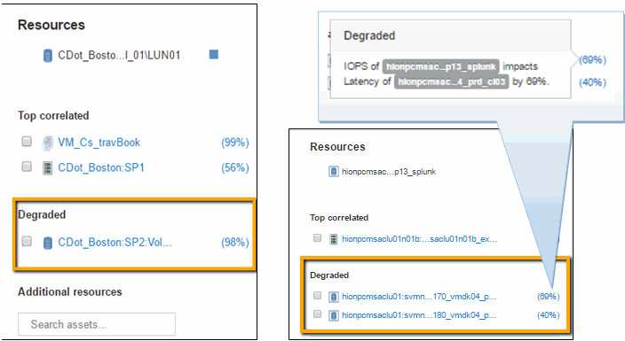

= 检查内部卷
:allow-uri-read: 
:icons: font
:imagesdir: ../media/

image::../media/greedy-vol1.gif[贪婪的vol1]

在内部卷登录页面中、您将看到：

* 内部卷的性能图表与先前显示的延迟和IOPS应用程序性能图表一致。
* 在显示相关资产的"Resources"部分中、标识了"`greedy`"资源(CDot_Boston：SP1：Vol_01)。

资源耗用情况通过Insight关联分析来确定。资源耗损/降级为"`对等方`"、它们利用相同的共享资源。耗损资源的IOPS或利用率会对降级资源的IOPS或延迟产生负面影响。

可以在虚拟机、卷和内部卷登录页面上确定资源耗用和降级。每个登录页面上最多将显示两个耗用资源。

选择相关排名(%)可提供大量资源分析结果。例如、单击一个耗用百分比值可标识对某个资产执行的操作、该操作会影响对已降级资产执行的操作、类似于以下示例所示。

image::../media/greedy-percentage.gif[耗用百分比]

确定降级的资源后、您可以选择降级(%)分数来确定影响降级资源的操作和资源。

