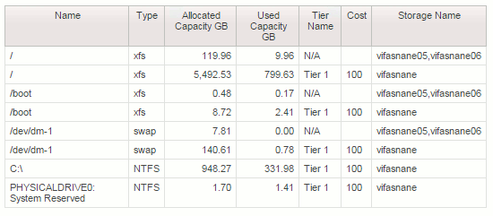

= 文件系统成本分摊和报告
:allow-uri-read: 
:icons: font
:imagesdir: ../media/

[role="lead"]
文件系统的成本分摊始终从存储角度执行。与为特定计算资源组标注的虚拟机关联的存储阵列将包含在该资源组的成本分摊报告中。

== 开始之前

要包含在文件系统利用率成本分摊中的任何虚拟机都必须使用适当的计算资源组名称进行标注。与这些虚拟机关联的存储阵列必须使用相应的层标注进行标注。在这些标注到位后、必须已将ETL传输到数据仓库。

== 步骤

. 通常打开报告服务器的浏览器 `https://<host or IP>:9300/p2pd``http://<host or IP\>:9300/bi (7.3.3 or later)` 并登录。
. 选择*文件系统利用率*软件包并创建新报告。
+
image::../media/fs-util-pkg.gif[fs util软件包]

. 从数据集市中拖放项目以构建报告。
+
以下示例是一个非常简单的报告。您可以根据特定业务需求创建复杂的报告。

+

