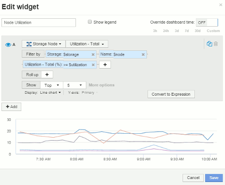
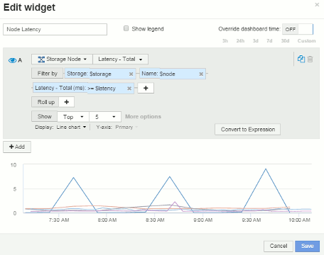

= 节点信息板小工具示例设置
:allow-uri-read: 
:icons: font
:imagesdir: ../media/

[role="lead"]
包含变量的节点信息板的小工具设置示例。

以下是存储节点信息板示例中每个小工具的设置。

节点利用率：

 image:../media/nodeutiltable.gif[""]

节点延迟：

 image:../media/nodelatencytable.gif[""]

存储池利用率：

image:../media/poolutilchart.gif[""] image:../media/poolutiltable.gif[""]

存储池吞吐量：

image:../media/poolthroughputchart.gif[""] image:../media/poolthroughputtable.gif[""]

卷延迟：

image:../media/vollatencychart.gif[""] image:../media/vollatencytable.gif[""]

卷IOPS：

image:../media/voliopschart.gif[""] image:../media/voliopstable.gif[""]
