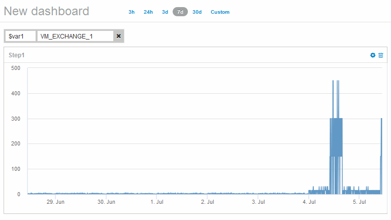

= 观察对象随时间变化的行为
:allow-uri-read: 
:icons: font
:imagesdir: ../media/

[role="lead"]
您可以观察单个对象的行为、以确定该对象是否在预期操作级别内运行。

== 步骤

. 使用查询来确定要分析的虚拟机：*查询*>*+新查询*>*虚拟机*>*"name"*
+
将名称字段留空将返回所有VM。选择要在本练习中使用的虚拟机。您可以通过滚动查看VM列表来选择它。

. 为要收集的信息创建一个新信息板。从工具栏中、单击*信息板*>*+新建信息板*。
. 在新的信息板中、选择*变量*>*文本*。
+
.. 将查询中的虚拟机名称添加为``$var1`` 价值。
.. 单击复选框。

+
此变量用于在要分析的不同对象集之间轻松地进行交换。在其他分析步骤中、您可以重复使用此变量对最初选择的单个虚拟机进行额外分析。在标识多个对象时、变量会变得更有用。

. 向新信息板添加折线图小工具：*小工具*>*折线图*。
+
.. 将默认资产类型更改为虚拟机：单击*虚拟机*>*延迟-总计*。
.. 单击*筛选依据*>*名称*>*$var1*。
.. 更改信息板上的时间段：*覆盖信息板时间*>*开*>* 7天*。

+
您可以使用任何预设选项或指定自定义时间范围来更改显示持续时间。

+
+信息板将显示指定时间段内虚拟机的* IOPS总数*。

. 为小工具分配一个名称并保存小工具。

== 结果

小工具应包含类似于以下内容的数据： 

虚拟机会在显示的7天内短时间内显示异常高的延迟。
