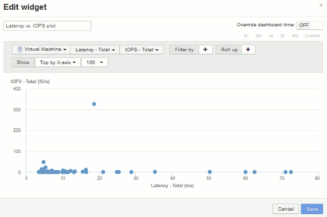

= 散点图示例：了解轴
:allow-uri-read: 
:icons: font
:imagesdir: ../media/

[role="lead"]
更改散点图小工具中计数器的顺序会更改显示数据的轴。

== 关于此任务

此示例将创建一个散点图，用于查看延迟较高而 IOPS 较低的性能较低的虚拟机。

== 步骤

. 在编辑模式下创建或打开信息板，然后添加 * 散点图 * 小工具。
. 选择资产类型、例如*虚拟机*。
. 选择要绘制的第一个计数器。对于本示例、请选择*延迟-总计*。
+
_Latency - total_ 沿图表的 X 轴绘制。

. 选择要绘制的第二个计数器。对于本示例、请选择* IOPS -总计*。
+
_IOPS - 总计 _ 沿图表中的 Y 轴绘制。延迟较高的 VM 将显示在图表的右侧。仅显示前 100 个延迟最高的虚拟机，因为 * Top by X-axis* 设置为当前值。

+

. 现在、将第一个计数器设置为* IOPS -总计*、将第二个计数器设置为*延迟-总计*、从而反转计数器的顺序。
+
现在、_Iatenci- total_会沿图表中的Y轴进行绘制、_IOPS - Tota_l会沿X轴进行绘制。此时， IOPS 较高的虚拟机将显示在图表的右侧。

+
请注意，由于我们尚未更改 * Top by X-Axis* 设置，因此小工具现在会显示前 100 个 IOPS 最高的虚拟机，因为这是当前沿 X 轴绘制的虚拟机。

+
image::../media/scatterplot2.gif[散点图2.]

. 您可以选择在图表中按 X 轴显示前 N ，按 Y 轴显示前 N ，按 X 轴显示后 N 或按 Y 轴显示后 N 。在最后一个示例中、此图表显示了总IOPS最高的前100个VM。如果我们将其更改为Top by Y-axis、则此图表将再次显示总延迟最高的前100个VM。
+
请注意、在散点图中、您可以单击某个点以打开该资源的资产页面。

