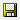

= 增加Cognos内存
:allow-uri-read: 
:icons: font
:imagesdir: ../media/

[role="lead"]
在还原数据仓库数据库之前、您应将Cognos的Java分配从768 MB增加到2048 MB、以缩短报告生成时间。

== 步骤

. 以管理员身份在数据仓库服务器上打开命令提示符窗口。
. 导航到 `disk drive:\install directory\SANscreen\cognos\c10_64\bin64` 目录。
. 键入以下命令： `cogconfigw`
+
此时将显示"IBM Cognos Configuration"窗口。

+
[NOTE]
====
IBM Cognos Configuration快捷方式应用程序指向 `disk drive:\Program Files\SANscreen\cognos\c10_64\bin64\cognosconfigw.bat`。如果Insight安装在默认的Program Files (空间介于)目录中、而不是ProgramFiles (无空间)目录中、则会显示 `.bat` 文件将不起作用。如果发生这种情况、请右键单击应用程序快捷方式并进行更改 `cognosconfigw.bat` to `cognosconfig.exe` 以修复快捷方式。

====
. 从左侧导航窗格中、展开*环境*、展开* IBM Cognos services*、然后单击* IBM Cognos*。
. 为Tomcat选择*最大内存(以MB为单位)*、并将768 MB更改为2048 MB。
. 在IBM Cognos Configuration工具栏上、单击 (保存)。
+
此时将显示一条信息性消息、告知您Cognos正在执行的任务。

. 单击 * 关闭 * 。
. 在IBM Cognos Configuration工具栏上、单击 image:../media/cognos-stop-icon.gif[""](停止)。
. 在IBM Cognos Configuration工具栏上、单击 image:../media/cognos-start-icon.gif[""](启动)。

