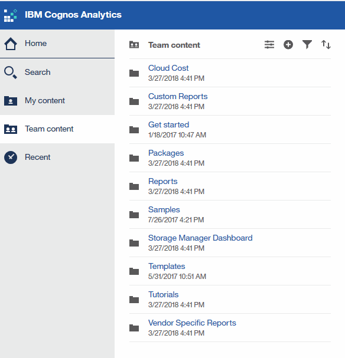

= 导航到预定义的OnCommand Insight 报告
:allow-uri-read: 
:icons: font
:imagesdir: ../media/

[role="lead"]
打开报告门户时、您可以从"团队内容"文件夹开始选择OnCommand Insight 报告中所需的信息类型。

== 步骤

. 在左侧导航窗格中、单击*团队内容*并选择要使用的信息类别。
+

. 单击 * 报告 * 以访问预定义报告。
. 单击*入门*、*示例*或*教程*、了解如何创建报告。

